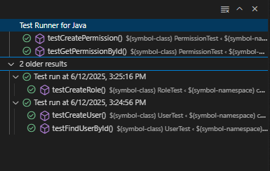
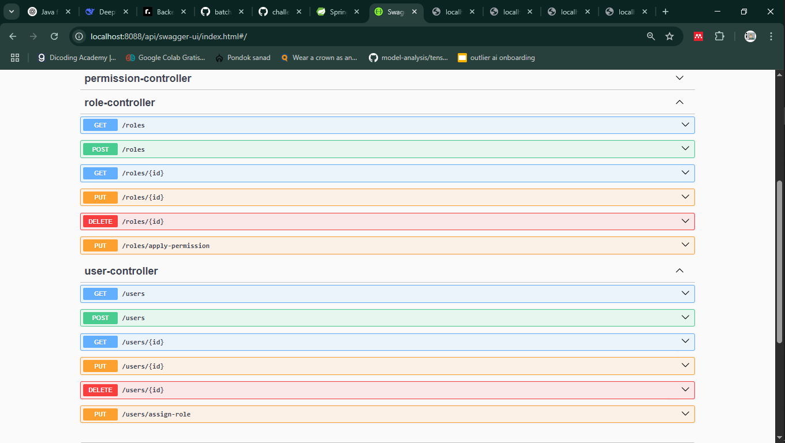

# Repo untuk file challenge code academy by codeID

1.    File Challenge Sql Day 1 [[Link File](https://github.com/Haniff-Toha/challenge_codeID_MH/blob/main/challange-day01.sql)]
2.    File Challenge Sql Day 2 [[Link File](https://github.com/Haniff-Toha/challenge_codeID_MH/blob/main/challange-day02.sql)]
3.    File Challenge Java Day 1 [[Link File](https://github.com/Haniff-Toha/challenge_codeID_MH/blob/main/ChallengeJavaDay01_mHaniff.java)]
4.    File Challenge Java Day 2 [[Link File](https://github.com/Haniff-Toha/challenge_codeID_MH/blob/main/challengeJavaDay02_mHaniff.java)]
5.    File Challenge Java Day 3 [[Link File](https://github.com/Haniff-Toha/challenge_codeID_MH/tree/main/challengeOop_mHaniff)]
6.    File Challenge Java Day 4 [[Link File](https://github.com/Haniff-Toha/challenge_codeID_MH/tree/main/part6_challangeDay04)]
7.    File Challenge Java Day 5 - oop final [[Link File](https://github.com/Haniff-Toha/challenge_codeID_MH/tree/main/challangeOOPFinal_MH)]
8.    File Challenge Spring MVC 1 Day 6 [[Link File](https://github.com/Haniff-Toha/challenge_codeID_MH/tree/main/HR)]
9.    File Challenge Spring MVC 2 Day 7 [[Link File](https://github.com/Haniff-Toha/challenge_codeID_MH/tree/main/eshopper)]
10.   File Challenge Springrest 1 Day 7 [[Link File](https://github.com/Haniff-Toha/challenge_codeID_MH/tree/main/eshopay-backend)]
11.   File Challenge Springrest 2 - Multipart Day 8 [[Link File](https://github.com/Haniff-Toha/challenge_codeID_MH/tree/main/eshopay-backend-multipart)]
12.   File Challenge Springrest 3 - Multipart bulk gambar Day 9 [[Link File](https://github.com/Haniff-Toha/challenge_codeID_MH/tree/main/eshopay-backend-multipart-bulk-gambar)]

## Challenge untuk magang 
### 1. Test Axa [[Link Folder](https://github.com/Haniff-Toha/challenge_codeID_MH/tree/main/testAxa_hr)]
  1. Test API

     

  2. Unit Test
     
